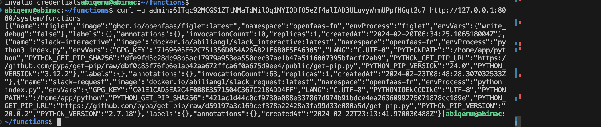
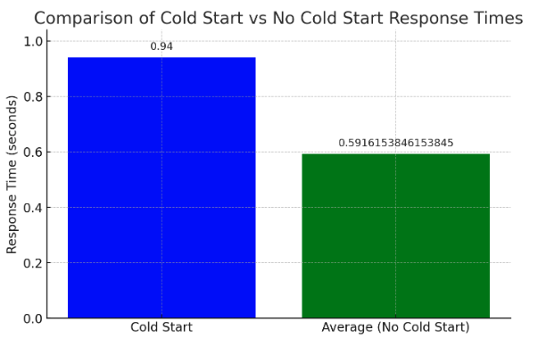

# Serverless Infrastructure
## Repo
github:https://github.com/AAbiAbi/ServerlessInfrastructure

## Prerequisite
### Setup VM

In the QEMU initialization command, you have configured port forwarding for SSH (port 22) using the -netdev user,hostfwd=tcp::2222-:22 option. You can add a similar option to forward port 8080, which is the default port for accessing the OpenFaaS UI.


```bash
qemu-system-aarch64 \
    -accel hvf \
    -cpu cortex-a57 \
    -M virt,highmem=off \
    -m 1024 \
    -smp 2 \
    -drive file=/opt/homebrew/Cellar/qemu/8.2.1/share/qemu/edk2-aarch64-code.fd,if=pflash,format=raw,readonly=on \
    -drive if=none,file=myqcow2image.qcow2,format=qcow2,id=hd0 \
    -device virtio-blk-device,drive=hd0,serial="dummyserial" \
    -device virtio-net-device,netdev=net0 \
    -netdev user,id=net0,hostfwd=tcp::2222-:22,hostfwd=tcp::8080-:8080 \
    -vga none \
    -device ramfb \
    -device usb-ehci \
    -device usb-kbd \
    -device usb-mouse \
    -usb \
    -nographic
```
### Install OpenFaaS CLI
```bash
curl -sSL https://cli.openfaas.com | sudo sh
```

In order to install faasd on your Linux VM, you can simply run the following commands.
```bash
$ git clone https://github.com/openfaas/faasd --depth=1 $ cd faasd
```
```bash
# Install faasd
$ ./hack/install.sh
```

After the installation, you must obtain your username and password by running
```bash
$ sudo cat /var/lib/faasd/secrets/basic-auth-password 
```

``` bash
$ sudo cat /var/lib/faasd/secrets/basic-auth-user
 
```
For convinence, you could store password to faas-cli.txt etc.

You can use this information to log in to the OpenFaaS UI or pass the information to the faas-cli by running the following command. You should be able to use faas-cli after this.


```bash
sudo systemctl status faasd
● faasd.service - faasd
     Loaded: loaded (/lib/systemd/system/faasd.service; enabled; vendor preset:>
     Active: active (running) since Tue 2024-02-20 06:06:19 UTC; 11min ago
   Main PID: 638 (faasd)
      Tasks: 7 (limit: 1015)
     Memory: 28.2M (limit: 500.0M)
     CGroup: /system.slice/faasd.service
             └─638 /usr/local/bin/faasd up

Feb 20 06:06:21 abimac faasd[638]: 2024/02/20 06:06:21 Resolver: "localhost"="1>
Feb 20 06:06:21 abimac faasd[638]: 2024/02/20 06:06:21 Resolver: "faasd-provide>
Feb 20 06:06:21 abimac faasd[638]: 2024/02/20 06:06:21 Resolver: "nats"="10.62.>
Feb 20 06:06:21 abimac faasd[638]: 2024/02/20 06:06:21 Resolver: "queue-worker">
Feb 20 06:06:21 abimac faasd[638]: 2024/02/20 06:06:21 Resolver: "prometheus"=">
Feb 20 06:06:21 abimac faasd[638]: 2024/02/20 06:06:21 Resolver: "gateway"="10.>
Feb 20 06:06:21 abimac faasd[638]: 2024/02/20 06:06:21 Looking up IP for: "prom>
Feb 20 06:06:21 abimac faasd[638]: 2024/02/20 06:06:21 Proxy from: 127.0.0.1:90>
Feb 20 06:06:21 abimac faasd[638]: 2024/02/20 06:06:21 faasd: waiting for SIGTE>
Feb 20 06:06:21 abimac faasd[638]: 2024/02/20 06:06:21 Proxy from: 0.0.0.0:8080>
lines 1-19/19 (END)
```
```bash
sudo cat /var/lib/faasd/secrets/basic-auth-password | faas-cli login --username admin --password-stdin


abiqemu@abimac:~$ sudo systemctl status faasd-provider
● faasd-provider.service - faasd-provider
     Loaded: loaded (/lib/systemd/system/faasd-provider.service; enabled; vendo>
     Active: active (running) since Tue 2024-02-20 06:06:19 UTC; 12min ago
   Main PID: 636 (faasd)
      Tasks: 5 (limit: 1015)
     Memory: 16.6M (limit: 500.0M)
     CGroup: /system.slice/faasd-provider.service
             └─636 /usr/local/bin/faasd provider

Feb 20 06:06:19 abimac systemd[1]: Started faasd-provider.
Feb 20 06:06:19 abimac faasd[636]: 2024/02/20 06:06:19 faasd-provider starting.>
Feb 20 06:06:19 abimac faasd[636]: faasd version: 0.18.6        commit: c61efe0>
Feb 20 06:06:19 abimac faasd[636]: 2024/02/20 06:06:19 Writing network config...
Feb 20 06:06:19 abimac faasd[636]: 2024/02/20 06:06:19 Listening on: 0.0.0.0:80>
lines 1-14/14 (END)
```


## Trying out a Function from the Store
```bash

abiqemu@abimac:~$ faas-cli store list

FUNCTION          AUTHOR       DESCRIPTION
nodeinfo          openfaas     NodeInfo
env               openfaas     env
sleep             openfaas     sleep
shasum            openfaas     shasum
figlet            openfaas     figlet
printer           openfaas     printer
curl              openfaas     curl
external-ip       openfaas     external-ip
youtube-dl        openfaas     youtube-dl
sentimentanalysis openfaas     SentimentAnalysis
hey               openfaas     hey
nslookup          openfaas     nslookup
certinfo          stefanprodan SSL/TLS cert info
alpine            openfaas     alpine
cows              openfaas     ASCII Cows
```
```bash
# Deploy figlet
abiqemu@abimac:~$ faas-cli store deploy figlet


Deployed. 200 OK.
URL: http://127.0.0.1:8080/function/figlet

# Find the URLs for the function

abiqemu@abimac:~$ faas-cli store inspect figlet
Title:       figlet
Author:      openfaas
Description: 
Generate ASCII logos with the figlet CLI

Image:    ghcr.io/openfaas/figlet:latest
Process:  figlet
Repo URL: https://github.com/openfaas/store-functions

# Create some ASCII

abiqemu@abimac:~$ echo "Hello, FaaS, world" | faas-cli invoke figlet
 _   _      _ _          _____           ____                        _     _ 
| | | | ___| | | ___    |  ___|_ _  __ _/ ___|   __      _____  _ __| | __| |
| |_| |/ _ \ | |/ _ \   | |_ / _` |/ _` \___ \   \ \ /\ / / _ \| '__| |/ _` |
|  _  |  __/ | | (_) |  |  _| (_| | (_| |___) |   \ V  V / (_) | |  | | (_| |
|_| |_|\___|_|_|\___( ) |_|  \__,_|\__,_|____( )   \_/\_/ \___/|_|  |_|\__,_|
                    |/                       |/                              
abiqemu@abimac:~$ echo "Hello, FaaS, world,this is Ningchen" | faas-cli invoke figlet
 _   _      _ _          _____           ____   
| | | | ___| | | ___    |  ___|_ _  __ _/ ___|  
| |_| |/ _ \ | |/ _ \   | |_ / _` |/ _` \___ \  
|  _  |  __/ | | (_) |  |  _| (_| | (_| |___) | 
|_| |_|\___|_|_|\___( ) |_|  \__,_|\__,_|____( )
                    |/                       |/ 
                    _     _  _   _     _       _     
__      _____  _ __| | __| || |_| |__ (_)___  (_)___ 
\ \ /\ / / _ \| '__| |/ _` || __| '_ \| / __| | / __|
 \ V  V / (_) | |  | | (_| || |_| | | | \__ \ | \__ \
  \_/\_/ \___/|_|  |_|\__,_( )__|_| |_|_|___/ |_|___/
                           |/                        
 _   _ _                  _                
| \ | (_)_ __   __ _  ___| |__   ___ _ __  
|  \| | | '_ \ / _` |/ __| '_ \ / _ \ '_ \ 
| |\  | | | | | (_| | (__| | | |  __/ | | |
|_| \_|_|_| |_|\__, |\___|_| |_|\___|_| |_|

               |___/                       
```
## DockerHub
Signing Up for DockerHub
In order for you to be able to push your function to the public, you would need a Docker hub account. Please sign up for one at https://hub.docker.com/ if you don’t have one. Make sure you note down your Docker Hub account and the password to be used in the next step.

Note Your Credentials:

Write down your Docker Hub username and password, or use a password manager. You'll need them to log in to Docker Hub from the command line.
Login from Command Line:

Once you have your Docker Hub account, you will need to log in from your local machine using the Docker CLI. This is usually done with the following command:
```bash
docker login
```
When prompted, enter your Docker Hub username and password.

## Push Function's Image:

After logging in, you can push your Docker images to Docker Hub. Typically, you'd build your Docker image with a tag that includes your Docker Hub username, like so:
```bash
docker build -t <your-dockerhub-username>/<repository-name>:<tag>
 ```
Then you'd push the image to Docker Hub:
```bash
docker push <your-dockerhub-username>/<repository-name>:<tag>
```


If you're working with OpenFaaS, you'll update your function's definition to use the Docker image from Docker Hub and then deploy it to OpenFaaS.
Remember, your Docker Hub repository is public by default, meaning anyone can pull and use your Docker images. If you want to keep your images private, you can create a private repository on Docker Hub, but note that the free account has a limit on the number of private repositories you can have.

Keep your credentials secure and ensure that you follow best practices for managing Docker images, such as not including sensitive data in your Docker images and using .dockerignore files to prevent unnecessary files from being added to the image.


Logging in with your password grants your terminal complete access to your account. 
For better security, log in with a limited-privilege personal access token. Learn more at https://docs.docker.com/go/access-tokens/

### Create a Base Folder for Functions:

The first command creates a directory for your OpenFaaS functions:
```bash
mkdir -p ~/functions && cd ~/functions
```


### Initialize New Functions with faas-cli:

The faas-cli new command is used to create a new function with a specified language template. In your case, you're using the Python language template.
Running these commands will generate boilerplate code for two functions named slack-request and slack-interactive:

```bash
abiqemu@abimac:~/functions$ faas-cli new --lang python slack-request
2024/02/20 10:29:07 No templates found in current directory.
2024/02/20 10:29:07 Attempting to expand templates from https://github.com/openfaas/templates.git
2024/02/20 10:29:08 Fetched 17 template(s) : [bun csharp dockerfile go java11 java11-vert-x node node14 node16 node17 node18 php7 php8 python python3 python3-debian ruby] from https://github.com/openfaas/templates.git
Folder: slack-request created.
  ___                   _____           ____
 / _ \ _ __   ___ _ __ |  ___|_ _  __ _/ ___|
| | | | '_ \ / _ \ '_ \| |_ / _` |/ _` \___ \
| |_| | |_) |  __/ | | |  _| (_| | (_| |___) |
 \___/| .__/ \___|_| |_|_|  \__,_|\__,_|____/
      |_|

```

Function created in folder: slack-request
Stack file written: slack-request.yml


```bash
abiqemu@abimac:~/functions$ faas-cli new --lang python slack-interactive
Folder: slack-interactive created.
  ___                   _____           ____
 / _ \ _ __   ___ _ __ |  ___|_ _  __ _/ ___|
| | | | '_ \ / _ \ '_ \| |_ / _` |/ _` \___ \
| |_| | |_) |  __/ | | |  _| (_| | (_| |___) |
 \___/| .__/ \___|_| |_|_|  \__,_|\__,_|____/
      |_|

```
Function created in folder: slack-interactive
Stack file written: slack-interactive.yml


### Update the Generated Code with Skeleton Code:

After running the faas-cli new commands, you'll have two new directories each containing handler.py, a YAML file (which will be named after your functions, such as slack-request.yml and slack-interactive.yml), and a requirements.txt file.
```bash
abiqemu@abimac:~/functions$ ls
slack-interactive      slack-request      template
slack-interactive.yml  slack-request.yml
abiqemu@abimac:~/functions$ cd slack-interactive/
abiqemu@abimac:~/functions/slack-interactive$ ls
handler.py  requirements.txt
```
Replace the contents of handler.py and the YAML files with the skeleton code you've been provided and fill in the blanks as required.
Make sure to also add any Python dependencies your functions might need into requirements.txt.


Enter your Docker Hub username and password when prompted.
Build, Push, and Deploy Functions:

Use faas-cli build to build Docker images for your functions based on the YAML files.
Use faas-cli push to push the built images to Docker Hub.
Use faas-cli deploy to deploy your functions to your OpenFaaS cluster.
The commands are as follows:
```bash

faas-cli build -f ./slack-interactive.yml
faas-cli push -f ./slack-interactive.yml
faas-cli deploy -f ./slack-interactive.yml

faas-cli build -f ./slack-request.yml
faas-cli push -f ./slack-request.yml
faas-cli deploy -f ./slack-request.yml
```
After doing deployment, it will show a successful deployment message and the url of function.


Now you can check the info of function on UI.


It's important that your YAML files contain the correct Docker image names, which should follow the format <your-dockerhub-username>/<repository-name>:<tag>.
Note: You might need to run some of these commands with sudo, depending on your setup.

After these steps, your functions should be built, pushed to Docker Hub, and deployed to OpenFaaS, making them callable via the gateway. Remember to test your functions to make sure they work as expected before considering the deployment complete.



Creating a chatbot as a serverless function involves setting up a function that can receive input, process it according to specific rules, and return a response. Here's how you could approach writing a chatbot function with the requirements you've described:

Set up the Function: Similar to Step 6, use the faas-cli new command to create a new function template. You might want to use a Python template if you're comfortable with Python, or choose another supported language you're familiar with.

Implement the Logic:

User Input: Your function should be designed to accept a string as user input.
Response Logic: Write logic within your handler function to handle different types of questions:
Name: If the input matches questions about the chatbot's name, return one of three predetermined responses.
Current Date and Time: If the input is about the current date or time, use a library or the language's built-in functionality to get the current date and time and return it in the response.
Figlet Generation: If the input is a request to generate a figlet, your function should call the previously deployed figlet function and return its output.
Here's a high-level example in Python for the chatbot function logic (to be put in handler.py):

```python
import datetime
import subprocess

def handle(req):
    # Case for asking the bot's name
    if "name" in req.lower():
        return "My name is Chatbot. You can call me 'Bot' or simply 'Chatbot'."

    # Case for asking the current time
    elif "current time" in req.lower() or "date" in req.lower():
        now = datetime.datetime.now()
        return f"The current time is {now.strftime('%H:%M:%S')} and today's date is {now.strftime('%Y-%m-%d')}."

    # Case for generating a figlet
    elif req.lower().startswith("generate a figlet for"):
        figlet_text = req[len("generate a figlet for"):].strip()
        # Invoke the figlet function using faas-cli
        result = subprocess.run(["faas-cli", "invoke", "figlet"], input=figlet_text, capture_output=True, text=True)
        return result.stdout

    # Default case if none of the above questions are asked
    else:
        return "I am not sure how to answer that. Can you ask something else?"

# Replace subprocess.run(...) with the appropriate way to invoke another function in your environment
```
## chatbox implementation


## Tasks

- Provide a screenshot of invoking the figlet function (5 pts)
```bash
curl http://127.0.0.1:8080/function/figlet -d 'Hello, FaaS, world'
echo -n "Your text" | faas-cli invoke figlet
```


- Provide a screenshot of running the following command (5 pts)
```bash
sudo journalctl -u faasd --lines 40
```


- Complete slack-request/handler.py (10 pts)
```bash
import json
import requests
# categorize the input into one of the specified types: a name inquiry, a current time/date inquiry, or a request for figlet generation.
def handle(req):
    """Identify the type of user request from the input question."""
    # Normalize and analyze the request
    req_lower = req.lower().strip()
    response_type = "unknown"  # Default response type
    
    # Determine the type of question
    if "name" in req_lower:
        response_type = "name"
    elif "current time" in req_lower or "date" in req_lower or "time" in req_lower:
        response_type = "time"
    elif req_lower.startswith("generate a figlet for"):
        response_type = "figlet"
    
    # Construct a response with the request type
    response = {"request_type": response_type, "original_request": req}
    # return json.dumps(response)
    
    # Categorize the request and prepare the payload
    payload = json.dumps(response)
    
    # Make the HTTP POST request to slack-interactive
    headers = {'Content-Type': 'application/json'}
    
    try:
        response = requests.post("http://gateway:8080/function/slack-interactive", data=payload, headers=headers)
    # # URL for the slack-interactive function
    # slack-interactive
    # # Return the response from slack-interactive
    # return response.text
        if response.status_code == 200:
                # Return the response from slack-interactive
                return response.text
        else:
            # Handle unexpected status code
            return f"Error: Received status code {response.status_code} from slack-interactive"
    except requests.exceptions.RequestException as e:
        # Handle request to slack-interactive failing
        return f"Error: Failed to send request to slack-interactive. Exception: {str(e)}"

    
# This function now returns a JSON object with the category of the request and the original request text.
```

- Complete slack-interactive/handler.py (10 pts)
```bash
import datetime
import json
import random
import subprocess
import requests
import sys
import json
import shlex

def handle(req):
    # print("Raw request:", req) #debugging
    try:
        data = json.loads(req)
    except json.JSONDecodeError as e:
        print("JSON decoding failed:", e)
        return "Failed to decode the request. Invalid JSON format."

    request_type = data.get("request_type")
    original_request = data.get("original_request", "")

    if request_type == "name":
        return handle_name_request()
    elif request_type == "time":
        return handle_time_request()
    elif request_type == "figlet":
        return handle_figlet_request(original_request)
        
    else:
        return "Sorry, I didn't understand that."

def handle_name_request():
    responses = [
        "My name is ChatBot.",
        "I'm called ChatBot.",
        "You can call me ChatBot."
    ]
    #randomly choose a response
    
    chosen_response = random.choice(responses)
    return chosen_response
    # return json.dumps({"response": responses})

def handle_time_request():
    now = datetime.datetime.now()
    responses = [
        f"Current time is {now.strftime('%H:%M:%S')}.",
        f"It's now {now.strftime('%Y-%m-%d %H:%M:%S')}.",
        f"The date today is {now.strftime('%Y-%m-%d')}."
    ]
    chosen_response = random.choice(responses)
    return chosen_response

def handle_figlet_request(original_request):
    message = original_request.replace("generate a figlet for", "").strip()
    # Directly return the response from invoke_figlet without wrapping in JSON
    # print(f"Handling figlet request for message: {message}")
    return invoke_figlet(message)

def invoke_figlet(text):
    # print(f"Invoking figlet with text:",text)  # Log to stderr
    
    # url = 'http://127.0.0.1:8080/function/figlet'
    headers = {'Content-Type': 'text/plain'}
    try:
        response = requests.post("http://gateway:8080/function/figlet", data=text, headers=headers)
        # print(f"Response from figlet function: {response.text}")
        
        # Check if the response's content type is plain text
        if response.status_code == 200 and response.headers.get('Content-Type') == 'text/plain':
            # print("Figlet response received.", file=sys.stderr)
            # print(response.text)
            return response.text
        else:
            print("Unexpected response type.", file=sys.stderr)
            return "Error: Unexpected response type from figlet function."
    except requests.exceptions.RequestException as e:
        error_message = f"Request to figlet function failed: {e}"
        print(error_message, file=sys.stderr)
        return error_message

```

- Provide a screenshot of your OpenFaaS gateway AFTER deploying figlet, slack-handler and slack-interactive functions (5 pts)


- Provide a screenshot of invoking slack-request and slack-interactive functions (5 pts)


- Complete the chatbot with a yml file (25pt)

in slack.yml. This file serves as a descriptor for all the functions that you want to deploy to your OpenFaaS gateway. Below is a sample stack.yml file for a chatbot system with three functions: slack-interactive, slack-request, and figlet.

```bash

provider:
  name: openfaas
  gateway: http://127.0.0.1:8080
  network: func_functions

functions:
  slack-interactive:
      lang: python3
      handler: ./slack_interactive
      image: abiliang1/slack_interactive:latest
      build_args:
        DOCKERFILE: .slack_interactive/dockerfile # Path to your custom Dockerfile

# Path: slack_interactive/dockerfile
  slack-request:
      lang: python3
      handler: ./slack_request
      image: abiliang1/slack_request:latest
  
  figlet:
    skip_build: true
    image:  ghcr.io/openfaas/figlet:latest
    fprocess: figlet


```

- Provide a screenshot of invoking three different cases of the chatbot (5 pts)


## Knowledge

1. What is the command to invoke the slack-request function (2 pts)?
    a.Via Curl
    b.Via faas-cli
B. But you can invoke function using either `crul` or `faas-cli`.

2. What is the output you see when you invoke the slack-request function? (2 pts)

The output of invoking the slack-request function depends on the input provided to it.When you invoke the slack-request function with an input string, it should output the response received from the slack-interactive function. If the POST request to slack-interactive is successful and returns a 200 status code, the output will be the response text from slack-interactive. If there is an error or a different status code, it will output an error message with the status code or the exception message received.

For example, if you invoke slack-request with the input "What is your name?", and everything is configured correctly, the output might be a JSON string with a response from slack-interactive, such as:
"My name is ChatBot." or "I'm called ChatBot." or "You can call me ChatBot."

If the service is unreachable or an error occurs, the output will be an error message, for instance:
```
Error: Received status code 500 from slack-interactive

```
or
```
Error: Failed to send request to slack-interactive. Exception: ConnectionError
```

3. What is the command to invoke the slack-interactive function? (2 pts)
    a.Via curl
    b.Via faas-cli
B
```bash
abiqemu@abimac:~/functions$ echo -n '{"request_type": "figlet", "original_request": "generate a figlet for time"}' | faas-cli invoke slack-interactive
 _   _                
| |_(_)_ __ ___   ___ 
| __| | '_ ` _ \ / _ \
| |_| | | | | | |  __/
 \__|_|_| |_| |_|\___|
```
But crul works as well
```bash
abiqemu@abimac:~/functions$ curl -d '{"request_type": "figlet", "original_request": "generate a figlet for time"}' http://127.0
.0.1:8080/function/slack-interactive
 _   _                
| |_(_)_ __ ___   ___ 
| __| | '_ ` _ \ / _ \
| |_| | | | | | |  __/
 \__|_|_| |_| |_|\___|
                      
```

4. What is the output you see when you invoke the slack-interactive function? (2 pts)

The output you see when invoking the slack-interactive function with faas-cli or curl will depend on the data you send to it and how the function is programmed to respond. 

a. If request_type is "name":

The function will return a randomly chosen response from the following:
- "My name is ChatBot."
- "I'm called ChatBot."
- "You can call me ChatBot."

b. If request_type is "time":

The function will return the current time in one of the following formats, chosen at random:
- "Current time is HH:MM:SS."
- "It's now YYYY-MM-DD HH:MM:SS."
- "The date today is YYYY-MM-DD."

c. If request_type is "figlet" and original_request contains a string to be transformed:

The function will return the string transformed into ASCII art by the figlet function.

d. If request_type does not match any of the above or is missing:

The function will return "Sorry, I didn't understand that."

5. How would you pass different arguments to the functions? (3 pts)


Pipe the input directly to the faas-cli invoke command. For example, to pass a JSON payload as an argument:
```bash
abiqemu@abimac:~/functions$ echo -n 'I wonder what is the time ' | faas-cli invoke slack-request
The date today is 2024-02-24.

abiqemu@abimac:~/functions$ echo -n 'Tell me your name' | faas-cli invoke slack-request
You can call me ChatBot.
```

6. How would you change the slack-interactive function to react to different inputs? (3 pts)

handle method would distingish which tyoe of the message is:
```bash
def handle(req):
    # print("Raw request:", req) #debugging
    try:
        data = json.loads(req)
    except json.JSONDecodeError as e:
        print("JSON decoding failed:", e)
        return "Failed to decode the request. Invalid JSON format."

    request_type = data.get("request_type")
    original_request = data.get("original_request", "")

    if request_type == "name":
        return handle_name_request()
    elif request_type == "time":
        return handle_time_request()
    elif request_type == "figlet":
        return handle_figlet_request(original_request)
        
    else:
        return "Sorry, I didn't understand that."

```


7. How long does it take for the chat response to come back? (10pts)


    a. For the first request that does not call figlet
    ```
    real    0m0.924s
    user    0m0.006s
    sys     0m0.034s
    ```
    
    b. For the second request that does not call figlet
    ```
    real    0m0.616s
    user    0m0.004s
    sys     0m0.015s
    ```
    c. Average over 10 requests that do not call figlet

    The average response time over the warm starts (excluding the first request, assumed to be a cold start) is approximately 0.628 seconds. The response time for the cold start was 0.924 seconds.


    d. For the first request that calls figlet
    
    e. For the second request that calls figlet

    

    f. For the second request that calls figlet that follows the first request that does not
    call figlet

    

    g. Average over 10 requests that do call figlet

    

    The chart above illustrates the comparison between the cold start response time and the average response time of subsequent requests (no cold start). As shown, the cold start response time is approximately 0.940 seconds, whereas the average response time for no cold start scenarios is about 0.592 seconds.

8. Now try sending a series of requests to the chatbot in parallel. At what queries per second does OpenFaaS add a new instance of the function? (6 pts)
```bash
abiqemu@abimac:~$ hey -n 100 -c 10 http://127.0.0.1:8080/function/slack-request

Summary:
  Total:        32.5708 secs
  Slowest:      4.2821 secs
  Fastest:      0.5152 secs
  Average:      3.1876 secs
  Requests/sec: 3.0702
  
  Total data:   3400 bytes
  Size/request: 34 bytes

Response time histogram:
  0.515 [1]     |■
  0.892 [0]     |
  1.269 [1]     |■
  1.645 [7]     |■■■■■■■■
  2.022 [7]     |■■■■■■■■
  2.399 [4]     |■■■■■
  2.775 [5]     |■■■■■■
  3.152 [11]    |■■■■■■■■■■■■■
  3.529 [13]    |■■■■■■■■■■■■■■■
  3.905 [35]    |■■■■■■■■■■■■■■■■■■■■■■■■■■■■■■■■■■■■■■■■
  4.282 [16]    |■■■■■■■■■■■■■■■■■■


Latency distribution:
  10% in 1.6756 secs
  25% in 2.7981 secs
  50% in 3.5443 secs
  75% in 3.8425 secs
  90% in 4.0047 secs
  95% in 4.1520 secs
  99% in 4.2821 secs

Details (average, fastest, slowest):
  DNS+dialup:   0.0002 secs, 0.5152 secs, 4.2821 secs
  DNS-lookup:   0.0000 secs, 0.0000 secs, 0.0000 secs
  req write:    0.0001 secs, 0.0000 secs, 0.0014 secs
  resp wait:    3.1872 secs, 0.5149 secs, 4.2820 secs
  resp read:    0.0001 secs, 0.0000 secs, 0.0046 secs

Status code distribution:
  [200] 100 responses

```
This command sends 100 requests (-n 100) to your function with a concurrency level of 10 (-c 10).

